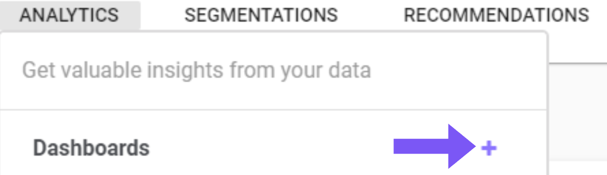
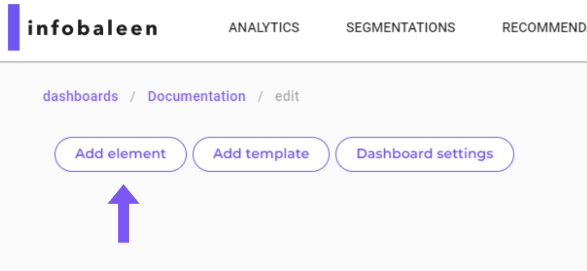
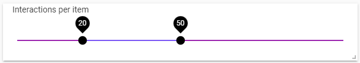
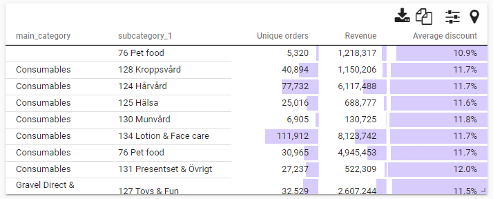
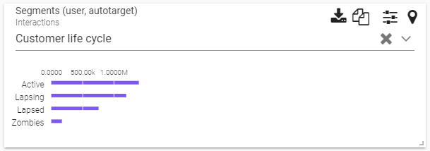

Dashboards can be created by clicking the + icon in the dropdown menu. When you create a dashboard you are asked for a name, this name can be changed later.

{:style="width:400px" .center}

<!-- 
 -->

Show Advanced Settings

<ul>
  <li><code>Select Role</code>: One of <code>interaction</code>, <code>user</code>, and <code>item</code>. Defines what data the dashboard should be based on, and in most cases it should be <code>interaction</code>.</li>
  <li><code>Select number of columns</code>: Specifies the number of columns used in the grid system to fit dashboards. The default value is used in most cases. </li>
  <li><code>Import config</code>: This field can be used if you want to copy or export a dashboard from another platform. It is left blank in most cases.</li>
</ul>

## View/edit mode
To see a preview of made changes, you can use the view/edit mode toggle on the top left side of the dashboard as seen below. This will allow you to gain an overview of the dashboard after your changes.

## Sections
A section can be seen as a group of elements. Applied filters in one section still applies to all the elements on the dashboard howeever. You can create multiple sections with different elements in each section. One of the positive aspects of using sections is that you can move a group of elements together without having to move each element individually, and also allowing to create copies of whole sections. To toggle on or off a section, you can use the two arrow icon, next to the clone icon.

## Add element

To add an element to your dashboard, click the <code>Add element</code> seen below.

{: style="width:400px"}
<!-- 
 -->

**Note!** After adding elements or editing the dashboard, remember to click `Save` in the top right corner.

### Clone an element
To create a copy of an element in a fast and effective way, use the clone icone `+` as seen below. This will create a duplicate of the chosen element below.

 {: style width="400px"}

### Metric
A metric is a single number, wich means that you can not show a field in a metric element (a field is an array of metrics). you can convert a field into a metric by writing an expression ex. SUM(field) this returns a metric.

{: style="width:400px"}

### Bar Chart
A bar chart shows `categorical data` with rectangular bars indicating the `distributions of the data`, in the picture below, we for example see amount of `unique customers per country`, the bar charts can be used to adapt the dashboard to show only data from one specific country. Simply press the country you want to see information about, and the dashboard will update accordingly.

{: style="width:400px"}

### Stacked Bar Chart
A stacked bar chart is made in the same way as a barchart, but with an added group key. The group key can be found under `Edit element` --> `Advanced` --> `Select group key`. Below is an example of a bar chart showing regions, with a group key on gender. 
{: style="width:400px"}

### Line Chart
A line chart plots a graph with data points connected to a chosen metric, example below for example shows revenue over time.  
Hovering over the line chart data points, the revenue for that time will show.

{: style="width:400px"}

Group key setting can be found under `Edit element` --> `Advanced` --> `Select group key` and allows you to see lines split over a category, see example below where gender is used as group key: 
{: style="width:400px"}

Show More Info

<ul>
  <li><code>Default</code>:Under default you can choose what values you want to include in your line chart, you can also select if you want the view to be from day to week, month etc. The `Format` selection lets you choose how many decimals you want, if you want the values to be shown as a percentage (%). The `Limit` lets you decide how many data points you want to show (the dots marked on the line). 
</li>
  <li><code>Style</code>Here you can change the appearance of the line chart in the dashboards, feel free to test how the different margin settings affect the look of the line chart! By changing the `Title` or the `Sub title` no values will be changed, by changing it the chosen values only gets an alias.  
</li>
</li>
  <li>In the <code>Advanced</code> tab you can <code>Select group key</code> by adding a field in the select group key the line chart will show multiple lines where each line represents a category in the selected field.
This function should be combined with a bar chart where you can create a filter for the selected field. by filtering out categories in the barchart the line chart will show the remaining categories.  

By filtering out a category in the bar chart the line representing this category is removed from the line chart.
</li>
</ul>

### Donut chart
A donut chart divides the data into sections, where each section represents a portion of the whole. The size of each section is proportional to the value it presents. If a section is too small to include or exceds the limit of sections found under settings, it will be included under the `others` section.

{: style="width:400px"}

### Histogram
A histogram is a graphical representation that shows data in specified ranges as vertical bins.

{: style="width:400px"}

### Date filter
The `Date filter` lets you adapt your dashboards to only show data for a chosen period of time, there are some premade limits, for example last week, last year etc. These can be found and chosen on the top of the date filter box after pressing it, you can also select a specified range of days by using the calendar.

{: style="width:400px"}

### Range filter
The `Range filter` allows you to only show data in the dashboards where a chosen value is within the chosen limit, for example if you only want to show data for items with prices between 100sek to 200sek.  

{: style="width:400px"}

### Filter
The `Filter` can be used to only show one category of chosen metric, and update the dashboard accordingly.

{: style="width:400px"}

### Metric selector
In the different `elements` added to your dashboard, for example a bar chart or line chart, there's the opportunity to select `*metric*`, if you then add a `Metric selector` and choose a metric, all the elements where `*metric*` has been chosen, will be updated to match the chosen metric in the `Metric selector`. Using this will allow quicker changes of the data shown, as you can use the metric selector instead of manually changing the other elements.

{: style="width:400px"}
 

### Alluvial Chart
An alluvial chart can be described as a flow diagram that represents changes in structures over time, for us this is mostly used to represent how segments of customers are changed over time, going from new, to lapsed (lost) customers.  
  
(There's a `Color scale` option under `Style` where the colors can be changed to blue/green/yellow/red instead of different shades of blue). Example of alluvial chart shown below.

{: style="width:400px"}

### Table
This element adds a table to the dashboard, if the table gets to wide there's a scroll bar furthest down in the table allowing horizontal scrolling. The table can be `sorted` by pressing on the value/text you want to sort by. Under `Style` in the edit screen of a table, there's an opportunity to add a `Background bar` which visualize how large/small the different values in the table are in comparison to the others. 

{: style="width:400px"}

### Pivot
A pivot table is used to visualize patterns and trends in large amounts of data, it can for example be used to show amount of lapsed customers per order cohort shown in the example below. Under `Edit element` you can select to show summarized values for row or/and columns. Under `Advanced` you can also select if you want each cell to show value/percent or both. There is also the ability to change if you want the calculations to be based upon rows or columns.

{: style="width:400px"}

### Image grid
The image grid shows pictures of products in a dashboard. This element requires product data to be present in the dashboard.

{: style="width:400px"}

### Segments
Lets you show data for only a chosen segment, these segments can be created under the `Segmentations` part of the platform.

{: style="width:400px"}

### Categories
Similar to bar chart, categories let's you choose what category to show data for, when the data is several categories in one cell, for example Color = `[red;blue]` where red and blue are not correlated.  

### Text Content
The text content element is the most used element. It's basically just text that can be adapted through either markdown or HTML.

{: style="width:400px"}

