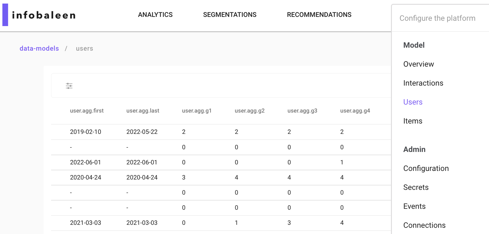
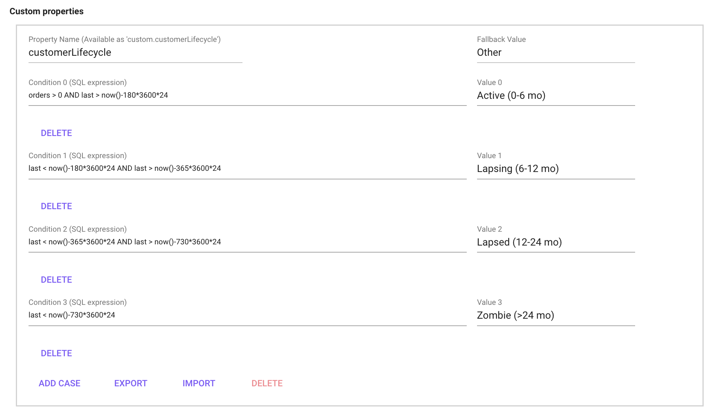

# Data models

## What is a data model? 
A data model is made up of of 3 tables (from the sources):

* Interaction table
* User table 
* Item table 

Each line in the interaction table is linked to a user and an item in the item and user table. When we have chosen what sources should be our interaction, item and user tables we can create a data model. After this we can start creating additional information through expressions. These expressions can later be used in dashboards. The relations and overview can be seen in the below image.

When a data model is used for email analysis, the interaction becomes a specific `email sent to a user`, the user becomes `the one receiving the email`, and the email that was sent is treated as an item.

## Edit a data model
To edit and see the detailed info about a data model, you need to edit it. You can edit it by clicking the "pen" either after clicking the data model, or in the data-models list, see images below.

Show another place to access the edit mode

## Interaction Configuration
The interaction table specifies info about the interaction (a user interacting with an item) that includes a timestamp (ts). An interaction config can look something like below:

<h4> Field</h4>
This is the name of the given in the source query (it can not be changed in the data model).  

<h4> Alias</h4>
By adding an alias the the field name is replaced by the alias name in the dashboard and segmentation. In Recommendation the field name is always shown even if an alias is added.

<h4> Role </h4>
<table>
<thead>
<tr>
<th>Name</th>
<th>Description</th>
</tr>
</thead>
<tbody>
<tr>
<td>Categories</td>
<td><code>Categories</code> is used when data is made up of multiple <code>category</code>&#39;s. The data format for <code>categories</code> has to be [<code>category1</code>;<code>category2</code>;<code>category3</code>;<code>etc</code>]</td>
</tr>
<tr>
<td>Revenue</td>
<td>Revenue can only be set on 1 field and should be <code>sales price (EX VAT)</code>. The reason you set mark your <code>sales price (EX VAT)</code> with the revenue role is to generate suggested revenue related expressions.</td>
</tr>
<tr>
<td>Quantity</td>
<td>If a user buys multiple items of the same SKU at the same time this will be either represented as <strong>1</strong> interaction row with quantity <code>x</code> In this case that field should be set to <code>Quantity</code>. for some data souces this will be represented as <code>x</code> interaction rows without a quantity row.</td>
</tr>
<tr>
<td>Timestamp</td>
<td>The timestamp role should only be set to the field that represent the interaction timestamp (when the interaction took place). other timestamps such as <code>return date</code> etc. should instead be set to number. The timestamp role is needed to create suggested expressions.</td>
</tr>
<tr>
<td>User</td>
<td>The User role is set to the key-field that connects the interaction table to the user table.</td>
</tr>
<tr>
<td>Item</td>
<td>The Item role is set to the key-field that connects the interaction table to the Item table.</td>
</tr>
<tr>
<td>Number</td>
<td>The Number role is automatically set to all fields that only contains numbers (you can make toFloat(<code>field</code>) without error). The number role lets you interact with a field as a number meaning you can make an calculation expressions such as if(<code>field</code> &gt; 100). If you want to make a histogram you can only use fields with role <strong>Number</strong> because you specify the <code>bin width</code> wich can only be done if the field is concidered a Number (does not work if the field is a <strong>Category</strong>).</td>
</tr>
<tr>
<td>Category</td>
<td>All fields that can not be classified as a <strong>Number</strong> are classified as a <strong>Category</strong>. <strong>Category</strong>&#39;s are used in for example Bar charts.</td>
</tr>
<tr>
<td>Enum</td>
<td></td>
</tr>
<tr>
<td>EnumCategories</td>
<td></td>
</tr>
</tbody>
</table>

<h4> Active </h4>

The Active toggle button lets you activate/deactivate a field. a deactivated field can not be used in dashboards.

<h4> Info </h4>
Click on the small `i` button to see a preview of how the data looks/is formatted.

## Item Configuration
The item table specifies info about the items, i.e. the products.

<h4>  Fields</h4>
This is the name of the given in the source query (it can not be changed in the data model).  

<h4> Alias</h4>
By adding an alias the the field name is replaced by the alias name in the dashboard and segmentation. In Recommendation the field name is always shown even if an alias is added.

<h4> Role</h4>

<table>
<thead>
<tr>
<th>Name</th>
<th>Description</th>
</tr>
</thead>
<tbody>
<tr>
<td>Categories</td>
<td><code>Categories</code> is used when data is made up of multiple <code>category</code>&#39;s. The data format for <code>categories</code> has to be [<code>category1</code>;<code>category2</code>;<code>category3</code>;<code>etc</code>]</td>
</tr>
<tr>
<td>Timestamp</td>
<td>The timestamp lets you work with unixtimestamp and shows the result in as a datetime (readable format).</td>
</tr>
<tr>
<td>Format</td>
<td>The format role represent the name of the item and is what is shown in the Image grid in the dashboards and in the recommendations</td>
</tr>
<tr>
<td>Image</td>
<td>The image role represent what field will be shown as a image in the Image grid in the dashboards and in the recommendations. The image field is usually called something with <code>url</code>.</td>
</tr>
<tr>
<td>Number</td>
<td>The Number role is automatically set to all fields that only contains numbers (you can make toFloat(<code>field</code>) without error). The number role lets you interact with a field as a number meaning you can make an calculation expressions such as if(<code>field</code> &gt; 100). If you want to make a histogram you can only use fields with role <strong>Number</strong> because you specify the <code>bin width</code> wich can only be done if the field is concidered a Number (does not work if the field is a <strong>Category</strong>).</td>
</tr>
<tr>
<td>Category</td>
<td>All fields that can not be classified as a <strong>Number</strong> are classified as a <strong>Category</strong>. <strong>Category</strong>&#39;s are used in for example Bar charts.</td>
</tr>
<tr>
<td>Enum</td>
<td></td>
</tr>
<tr>
<td>EnumCategories</td>
<td></td>
</tr>
</tbody>
</table>

<h4>  MLMeta</h4>
The MLMeta toggle button controls what is returned when when you make an API call. This is to give you control what data you want to return to the customer. You don't want to activate MLMeta on all fields because this will result in returning a lot of "trash columns" to the customer that they have to filter in turn get the relevant data. Note that you also have to select the role `Image` and `Format` for the product to show. MLMeta is only relevant in the recommendations view.

<h4>  MLFilter</h4>
The MLFilter lets you write expressions and filter your data in in the recommendations. You should only activate MLFilter for the fields you actually want to create a filter for, the reason for this is that when you activate **MLFilter** for a field this will store all data in the memory and every time the API calls for a recommendation the data model have to iterate through all fields with **MLFilter** resulting in a bad performance on the customers side (when the customer want to load our recommendations on their site the load speed will depend on how many **MLFilters** you have activated.  

<h4> Active </h4>

The Active toggle button lets you activate/deactivate a field. a deactivated field can not be used in dashboards.

<h4>  Info</h4>
Click on the small `i` button to see a preview of how the data looks/is formatted.

## User config
The user table specifies info about the users, i.e. the customers. 

<h4> Field</h4>
This is the name of the given in the source query (it can not be changed in the data model).  

<h4> Alias </h4>
By adding an alias the the field name is replaced by the alias name in the dashboard and segmentation. In Recommendation the field name is always shown even if an alias is added.

<h4> Role</h4>

<table>
<thead>
<tr>
<th>Name</th>
<th>Description</th>
</tr>
</thead>
<tbody>
<tr>
<td>Categories</td>
<td><code>Categories</code> is used when data is made up of multiple <code>category</code>&#39;s. The data format for <code>categories</code> has to be [<code>category1</code>;<code>category2</code>;<code>category3</code>;<code>etc</code>]</td>
</tr>
<tr>
<td>Timestamp</td>
<td>The timestamp lets you work with unixtimestamp and shows the result in as a datetime (readable format).</td>
</tr>
<tr>
<td>Pll</td>
<td></td>
</tr>
<tr>
<td>Email</td>
<td></td>
</tr>
<tr>
<td>Number</td>
<td>The Number role is automatically set to all fields that only contains numbers (you can make toFloat(<code>field</code>) without error). The number role lets you interact with a field as a number meaning you can make an calculation expressions such as if(<code>field</code> &gt; 100). If you want to make a histogram you can only use fields with role <strong>Number</strong> because you specify the <code>bin width</code> which can only be done if the field is considered a Number (does not work if the field is a <strong>Category</strong>).</td>
</tr>
<tr>
<td>Category</td>
<td>All fields that can not be classified as a <strong>Number</strong> are classified as a <strong>Category</strong>. <strong>Category</strong>&#39;s are used in for example Bar .</td>
</tr>
<tr>
<td>Enum</td>
<td></td>
</tr>
<tr>
<td>EnumCategories</td>
</tr>
</tbody>
</table>

<h4> Persona</h4>

The Persona toggle button controls what columns are used in the recommendations. For example, if we activate the field `gender` as a Persona, the recommendation engine will base the recommendations on what gender the user has. If we active the field `age` it will be used as a dimension in the recommendation, and so on.

<b>Note:</b> Use a maximum of 2 columns to define persona. Alternatively, make sure that the cardinality (number of groups) is less than 1000. (ex gender: 2 different and cities: 500 different, which means `2*500 = 1000` groups)

## Custom properties

The Custom properties-section lets you define custom user group based on your data. The feature exploits the aggregated user data that can be found in the menu at `Model->Users`, see the image below.

Using for example `user.agg.first` and `user.agg.orders` as parameters `first` and `orders` it is possible to create, for example, a customer lifecycle definition as in the image below.  

## Expression syntax

<table>
<thead>
<tr>
<th>Function</th>
<th>Description</th>
</tr>
</thead>
<tbody>
<tr>
<td><code>SUM()</code></td>
<td>Summarize a value, for example SUM(returned_quantity) returns the total amount of returned quantity (over chosen period of time)</td>
</tr>
<tr>
<td><code>uniq()</code></td>
<td>counts the amount of unique values, for example uniq(user) returns the amount of unique users.</td>
</tr>
<tr>
<td><code>uniqExact()</code></td>
<td>Is almost the same as uniq(), however uniq() may have a very small inaccuracy (that most often doesn&#39;t matter at all), but if it&#39;s important to have for example 100.002 (correct) instead of 100.000, use uniqExact(). The reason for this is simply that uniq() is less demanding.</td>
</tr>
<tr>
<td><code>countIf()</code></td>
<td>this counts +1 for each time an argument is correct on an interaction (row). <code>Example</code>: let&#39;s say there&#39;s 10 interactions (ten rows) in a table with a column that&#39;s currency. On 7 of the 10 rows the currency column consists of &#39;SEK&#39;, if we now use countIf(currency = &#39;SEK&#39;) we will get the value 7.</td>
</tr>
<tr>
<td><code>sumIf()</code></td>
<td>sumIf(Value that will be summarized when, X = N)  <code>Example</code>: sumIf(revenue, currency = &#39;SEK&#39;)</td>
</tr>
<tr>
<td><code>uniqIf()</code></td>
<td>multiIf(boolean, result_1, boolean, result_2, ..., boolean, result_n, else_this) multiIf(name = &#39;red&#39;, colour, name = &#39;big&#39;, &#39;size&#39;, &#39;no data&#39;)</td>
</tr>
</tbody>
</table>

# Data model expression examples 
Expressions can be used to calculate certain variables, for example the amount of returned items `(SUM(returned_quantity)` or divide certain users into different categories, for example dividing the customer base into customers with or without > 1 purchases. Expressions are made in the edit mode of a data model, and later can be found and used in dashboards as parameters and metrics. 

When writing expressions, remember to check and/or modify so that the variables like `revenue`, `ts` (timestamp), `quantity` is correct according to your data. returned quantity can for example be written in different ways (example: `returnedQuantity` / `returned_quantity`)  depending on data source. returnedQuantity, returned_quantity depending on the dataset.

### Interaction expressions

<table>
<thead>
<tr>
<th>Expression</th>
<th>Description</th>
</tr>
</thead>
<tbody>
<tr>
<td><strong>Days since previous order cohort</strong></td>
<td>multiIf (agg.daysFromPrev &lt;=30,&#39;1.<30', agg.daysFromPrev <=60,'2.30-60', agg.daysFromPrev <=90,'3.60-90', agg.daysFromPrev <=180,'4.90-180', agg.daysFromPrev <=360,'5.180-360', agg.daysFromPrev <=720,'6. 360-720', agg.daysFromPrev <=4000,'7.>720&#39;, &#39;8.New&#39;)</td>
</tr>
<tr>
<td><strong>Has return</strong></td>
<td>multiIf(returned_quantity &gt; 0, &#39;Return&#39;, &#39;No return&#39;)</td>
</tr>
<tr>
<td><strong>First order (month</strong></td>
<td>toStartOfMonth(user.agg.first)</td>
</tr>
<tr>
<td><strong>Active week</strong></td>
<td>toMonday(ts)</td>
</tr>
<tr>
<td><strong>Active month</strong></td>
<td>toStartOfMonth(ts)</td>
</tr>
<tr>
<td><strong>% discount</strong></td>
<td>SUM(full_price-revenue)/SUM(full_price)</td>
</tr>
<tr>
<td><strong>Revenue</strong></td>
<td>SUM(revenue)</td>
</tr>
<tr>
<td><strong>Price per item</strong></td>
<td>SUM(revenue)/SUM(quantity)</td>
</tr>
<tr>
<td><strong>Revenue per user</strong></td>
<td>SUM(revenue)/uniq(user)</td>
</tr>
<tr>
<td><strong>Average order value</strong></td>
<td>SUM(revenue)/uniq(user,ts)</td>
</tr>
<tr>
<td><strong>Sold items</strong></td>
<td>SUM(quantity)</td>
</tr>
<tr>
<td><strong>Items per order</strong></td>
<td>SUM(quantity)/uniq(user,ts)</td>
</tr>
<tr>
<td><strong>% returned quantity</strong></td>
<td>SUM(returned_quantity)/SUM(quantity)</td>
</tr>
<tr>
<td><strong>LTV 30d</strong></td>
<td>We usually do 5 different LTV metrics, just remember to change name accordingly to selected amount of days. <code>sumIf(revenue, ts &lt; user.agg.first + 30 AND addDays(user.agg.first, 30) &lt;= now())/uniqIf(user,addDays(user.agg.first, 30) &lt;= now())</code>, <code>sumIf(revenue, ts &lt; user.agg.first + 60 AND addDays(user.agg.first, 60) &lt;= now())/uniqIf(user,addDays(user.agg.first, 60) &lt;= now())</code>, <code>sumIf(revenue, ts &lt; user.agg.first + 90 AND addDays(user.agg.first, 90) &lt;= now())/uniqIf(user,addDays(user.agg.first, 90) &lt;= now())</code>, <code>sumIf(revenue, ts &lt; user.agg.first + 180 AND addDays(user.agg.first, 180) &lt;= now())/uniqIf(user,addDays(user.agg.first, 180) &lt;= now())</code>, <code>sumIf(revenue, ts &lt; user.agg.first + 365 AND addDays(user.agg.first, 365) &lt;= now())/uniqIf(user,addDays(user.agg.first, 365) &lt;= now())</code></td>
</tr>
<tr>
<td><strong>Returned quantity</strong></td>
<td>SUM(returned_quantity)</td>
</tr>
<tr>
<td><strong>Returned or not returned</strong></td>
<td>multiIf(returned_quantity &gt; 0, &#39;Return&#39;, &#39;No return&#39;)</td>
</tr>
</tbody>
</table>

### Item expressions  

<table>
<thead>
<tr>
<th>Description</th>
<th>Expression</th>
</tr>
</thead>
<tbody>
<tr>
<td>Sold items [item based dashboards] <code>(item based dashboards here means that item is chosen as Role when creating the dashboard)</code></td>
<td>SUM(article_number.agg.trans)</td>
</tr>
<tr>
<td>Available quantity [item based dashboards] <code>(item based dashboards here means that item is chosen as Role when creating the dashboard)</code></td>
<td>SUM(item.in_stock)</td>
</tr>
<tr>
<td></td>
<td>SUM(full_price-PriceExVatIncDiscSEK)/SUM(full_price)</td>
</tr>
<tr>
<td></td>
<td>SUM(DiscountSEK) / SUM((DiscountSEK + PriceIncVatIncDiscSEK)</td>
</tr>
</tbody>
</table>

### User expressions

<table>
<thead>
<tr>
<th>Description</th>
<th>Expression</th>
</tr>
</thead>
<tbody>
<tr>
<td>Users &gt; 1 order</td>
<td>uniqIf(user,user.agg.orders&gt;1)/uniq(user)</td>
</tr>
</tbody>
</table>

