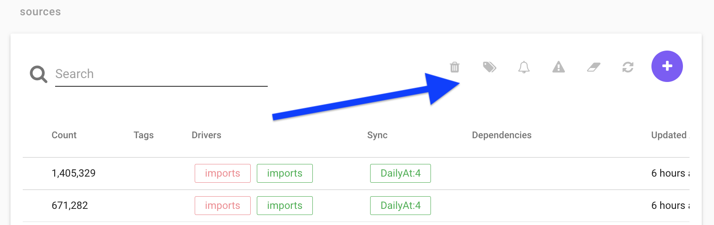

## Create sources
When the [data has been imported](Import-Files.md), go to `Manage Data -> Sources` and create a new source by clicking the purple plus sign as seen in the below image. 

1. Name the source `import_[source of data]_[type of data]` where `[source of data]` specifies where the data comes from (centra, voyado, etc), and the `[type of data]` specifies the data type (items, users, interactions, etc). 


2. Choose an identifier for the source using the `Id columns` field.  If the source you’re creating is for:
    * **interactions**: we want to identify each interaction through a user, an item and the time of the purchase, therefore choose user,ts,item under id columns and then press create.
    * **items**: we want to identify each item by using an item id (often sku or variant). 
    * **users**: we want to identify each user by using a user id. 

The fields `Comment` and `Merge Filter` can be left empty, and you can press `CREATE`. 

3. Choose database connection and create a `QUERY` 
If it’s a centra/voyado customer choose that option, if the files were uploaded manually, choose imports.

You can now see the query stage, as standard ```“SELECT * FROM `*`”``` will show, if you press “EXECUTE PREVIEW SUMMARY” you will see all the imported files you can choose to gather data from. Copy the filename you want to use and enter that name in the query above, like `SELECT * FROM [ENTER FILENAME HERE]`.

The import file is now done, press sync and save to exit. 

4. Now repeat the "Create source"-step 2 but name the file `model_[source of data]_[type of data]` (the use same identifier as in the import file). 
    * In the `Choose database connection` now choose `source` instead, and press `execute preview summary`, now choose the import source file and edit the query to select from that, like "`SELECT * FROM ENTER_SOURCENAME_HERE`" and then press `Save and sync`.


## Frontpage columns
See below an example image from source view, with a source named `transactions`.


Here is a short explanation of the columns (note that not all columns are shown in the above image):

</h4> Name </h4>
Name of source

<h4> id </h4>
Every source has an unique id which is used to show dependencies between sources.

<h4> Count </h4>
Count describes how many rows the source have. There can only be 1 row for every unique key column. if there are multiple rows with the same key all but 1 is removed.

<h4> Tags </h4>
You can tag a source to keep track of how it is used.

<h4> Drivers </h4>
The drivers show what driver is used and also if it is active (green) or inactive (red). If a source has multiple queries there will be multiple drivers, here you can see wich source is active and wich are not.

<h4> Sync </h4>
You can set a daily sync for the source, for example `DailyAt:6`.
<br>

<h4> Dependencies </h4>

Dependencies for a source show what other sources the are used to build up the source.  An example for this is 
```
SELECT * FROM Source1  
LEFT JOIN Source2 on Source2.id = Source1.id  
UNION  
SELECT * FROM Source3  
```
This will show the id for source 1,2,3 in the Dependencies for the new source.


<h4> Updated At </h4>
Shows how long ago the source was last modified.

<h4> Synced At </h4>
Shows how long ago the source was last synced.


<h4> Top Menu </h4>

In the source view there are also some funcationality that can be accessed using the icons in the top right corner.



<h4> Delete </h4>
Delete the selected source.


<h4> Tag </h4>
Select a source, click Tag and write a new tag or select an old tag.

 <h4> Set sync schedule </h4> 
Configure a daily data sync to update the source on a regular basis.

<h4> Migrate </h4>


<h4> Truncate </h4>
Truncate wipes the source of all data. This is usefull if you have changed key column for example because if you just sync the data the old data is not removed. 
[Note that some sources only read 1 week data at the time to save time, if you truc a source like this all historic data is removed wich is bad]

<h4> Sync </h4>
Manually syncs the source.

<h4> Create </h4>
Creates a new source.


## Edit a source

When clicking a source, you find the edit mode by clicking the "pen" in the top right corner. This will open a view as can be seen in the image below. 


<h3> Settings <h3>

<h4> Name </h4>
Just a name

<h4> Id columns </h4>
The Id columns has to be choosen to be unique. if the id is not unique (the same id for many rows) only 1 row will be saved and all others are removed.  
For the interaction table the id has to contain user AND id or ts,item. The reason user has to be an id column is because when user is the first id column all interactions are sorted on user first. this lets you use expressions such as agg.i wich count number of interactions a user has made. if the interaction table is not sorted on user first the aggregation functions doesnt work.  
For multiple id columns they are sorted in the order they are written.
User,ts,item is sorted first on user, then on ts and lastly on item.  

SELECT CUSTOM COLUMNS is usefull if you want other names than the predefined such as SKU.

<h4> RunEvery </h4>
Set a sync time

<h4> Comment </h4>

<h4> Merge filter </h4>
lets you filter out your query before you save it.

A Merge filter discards everything that is not true before saving the table. For example if you add a query similar to `toFloat(ts) > now()-100*24*3600`, then all timestamp (ts) data from later than 100 days will be discarded.


<h4> Overview </h4>
Shows what is in the source currently

<h4> Query </h4>

<h4> Database connection </h4>
Define the type of connection for the data to be added to the source.

<h4> Load saved query </h4>
lets you reload previously run queries

<h4> Preprocessor directives </h4>
Preprocessor information can be found under the "Import Files" section of the documentation.

<h4> Query expressions <h4>
You need to enclose variable names that contain other characters than letters and numbers with `backticks` ` `,  
this includes whitespace ' ', dot '.', etc...


## Below is further information about more advanced queries

SELECT * FROM `raw: 
id,item
1,item1
2,item2`
this returns a table.
<br>

UNION 

A UNION merges two data sources by including all unique rows from both. When making a union the columns need to have the same name and be in the same order
```
SELECT * FROM `table 1`
UNION
SELECT * FROM `table 2`
```
if you have overlapping id rows in `table 1` and `table 2` the id in `table 1` will be saved and `table 2` will be discared.
ex. 
to try this, create a test source
```
select 
incr(1,50) AS id,
'table 1' AS item
from `<RANDOM_SOURCE>`

UNION
select 
incr(1,1) AS id,
'table 2' AS item
from `<RANDOM_SOURCE>`
```
then create a new source 
```
SELECT * FROM `<TEST_SOURCE>`
```
this will show that all overlapping ids will have item from `table 1`.

A UNION can also be suffixed by ALL, where UNION ALL will not discard duplicates, meaning much faster execution but leaves duplicate rows if they exist.


INSERT INTO


insert into lets you create multiple tables in the same query that you can use to create a UNION or LEFT JOIN.
```
INSERT INTO <table_name>
SELECT * FROM `<source_name>`
;
``` 
The `;` is needed to mark where the table end. 
When using the table you created with INSERT INTO you use the <table_name> not the <source_name>
ex.
```
LEFT JOIN <table_name> ON <table_name>.id = XXX.id
```


LEFT JOIN and JOIN

LEFT JOIN lets you append more columns to an existing table, while join only keeps the ones matching. See below a code example where you can change `left join` to `join` to see the effects.

```
INSERT INTO countries SELECT * FROM `raw:
id,country
1,se
2,no
`;

INSERT INTO currencies SELECT * FROM `raw:
country,currency
se,sek
us,usd
`;


select * from countries
left join currencies ON countries.country = currencies.country

```


NOT IN

Only selects rows that do not match, example

```
SELECT * from `raw:
id,name
1,anni-frid
2,agnetha
3,björn
4,benny
`
WHERE name NOT IN ('anni-frid', 'agnetha')
```

Will return 

```
id,name
3,björn
4,benny
```


firstSeen()


firstseen(<field>) saves only the first encountered row for 

coalese

toFloat()

unixTimestamp()


split() and slice() and slicestr()


These expressions can be used to edit strings, see an example below:

```        
Insert into a
SELECT * FROM `raw:
a   b
1   ABCDE`
;

SELECT 
    a AS a,
    split(b,'') AS step1,
    slice(split(b,''),0,3) AS step2,
    replace(slice(split(b,''),0,3),',','') AS step3,
    length(b),
    slicestr(b,1,2)
FROM a
```

The result will be:
```
a	step1	     step2.     step3	 length(b)    slicestr(b, 1, 2)
1	A,B,C,D,E.   A,B,C	ABC	 5            BC
```


groupconcat_ws


```	
Insert into a
SELECT * FROM `raw:
Id,user,ordernr,item,price
1,100,1,A,"10SEK"
2,100,1,B,"20SEK"
3,100,1,C,"30SEK"`
;
SELECT user, ordernr, groupconcat_ws(price, ',') price_list FROM a
```
	
The result will be:
```
user	ordernr	price_list
100	1	10SEK,20SEK,30SEK
```

	
Create a custom user.agg.(field)


the datamodel creates aggregate functions such as user.agg.revenue.
to create one yourself do the following.
In the below example I create `user.agg.margin` similar to `user.agg.revenue`
	
```
--aggregates margins per user same as user.agg.revenue but with margin
INSERT INTO margin
SELECT
	user AS user,
	concat('',SUM(margin)) AS total_margin
FROM `s3 - transactions`;
	
SELECT 
UI.user AS user,
margin.total_margin AS total_margin,
UI.other fields...
FROM `user_import` AS UI
	
LEFT JOIN margin ON margin.user = UI.user
```
Note that you need to add `concat('',)` to the sum expression.
this is because you cant LEFT JOIN a float. `concat('',)` converts it into a string.
`concat('',SUM(margin)) AS total_margin`


