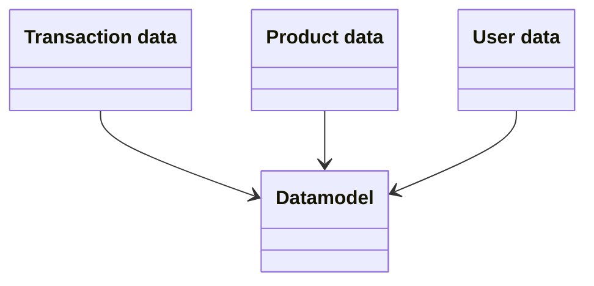

## Sift Lab - Data Specification

A datamodel in Sift Lab is made up of three data tables. Each line in the interaction table is linked to a specific user and item in the item and user tables. 





### Data encoding

Data must be encoded as UTF-8 + RFC 4180 (see more info at [https://tools.ietf.org/html/rfc4180](https://tools.ietf.org/html/rfc4180)). Below are some specifics regarding the cell and row formatting.

| Case      | Example |
| ----------- | ----------- |
| Line break      | \n   |
| Quotes must be escaped  | “14”” TV”  |
| Cell wrap with double if the value contains , or \n | “Hello, world” |
| Number, avoid space and comma. | 12345678.9 |
| Timestamp/date, use unix timestamp or formatted date string. | 1591718519 or “2020-03-17 15:01:02” or “2006-01-02T15:04:05-0700” |


A valid example

```
id,value,number
1,"Hello, world!",123.45
2,"14"" TV",123.45
```

### Transaction data
Provide a file containing transactional data between your products and users. Usually represents order rows.

If necessary, you may provide an additional file with data that is associated with an order number. An example would be an order header containing shipping cost, payment fee etc. In this case, provide an order number in the transactional data, and use the order number as the unique identifier in the orders file. 

| Field | Data type | Note |
| ----- | ---- | ----- |
| id | ID (required) | Must uniquely identify a transaction/order row. |
| user_id | ID (required) | Must uniquely identify a user. | 
| product_Id | ID (required) | Must uniquely identify a product. | 
| timestamp | Timestamp (required) | Timestamp at which the interaction occurred. |
| revenue | Number | (Product price x quantity) Use sales ex VAT | 
| vat_percent | Number | | 
| margin | Number | | 
| discount | Number | Discount for all items in the row.| 
| currency | String | | 
| exchange_rate | Number | If you have sales in different currencies.| 
| order_status | String | | 
| order_number | String | | 
| quantity | Number | Number columns must be adjusted for quantity, ex the Revenue/Margin column must be equal to the Total Revenue/Margin for that interaction. | 
| cancelled_quantity | Number | | 
| returned_quantity | Number | | 
| coupons/campaigns |  String | If multiple, use semicolon separated list: “DiscountA;DiscountB” | 
| payment_method | String | | 
| payment_price | Number | | 
| shipping_method | String | | 
| shipping_price | Number | | 
| ...< ANY > |  Number, String | Additional metadata may be added that you find interesting to examine in our analytics. | 

### Product data
Provide a file containing product (item) meta data. Make sure all product ids that are present in the transactions are also present in this file.

Categorical data in hierarchical structure should be added as separate columns: `category_1`, `category_2`, etc. If a product can have multiple categories but without hierarchy, provide them as a semi-colon separated string: `“categoryA;categoryC:categoryE”`. An example would be genres for a movie, as a movie can be associated with multiple genres in no particular order.

| Field | Data type | Note |
| ----- | ---- | ----- |
| id | ID (required) | Must uniquely identify a product.| 
| title | String | A name that will be associated with the product.| 
| image_url | String | URL to product image.| 
| brand | String | | 
| in_stock | Number | Number of items in stock.| 
| supplier | String | | 
| price | Number | | 
| price_discounted | Number | Ex if there is a campaign present.| 
| product_url | String |  URL if product recommendations are to be used.| 
| status | String | | 
| created | Timestamp | |  
| category_1 … | String | Use multiple columns if hierarchical structure.| | 
| ...< ANY > | Number, String | Additional metadata may be added that you find interesting to examine in our analytics. | 

### User data
Provide a file containing user meta data. Make sure all user ids that are present in the transactions are also present in this file.

In order to have deletes propagate to our side, provide users with empty data on all fields except id or a `“is_deleted”` field that we will use to clear all metadata.

| Field | Data type | Note |
| ----- | ---- | ----- |
| id | ID (required) | Must uniquely identify a user, same as in transactions.
| email | String | | 
| age | Number | | 
| birthdate | Date | May be used to extract age by platform | 
| city | String | | 
| country | String | | 
| market | String | | 
| gender | String | | 
| created | Timestamp | | 
| ...< ANY > | Number, String | Additional metadata may be added that you find interesting to examine in our analytics. | 


